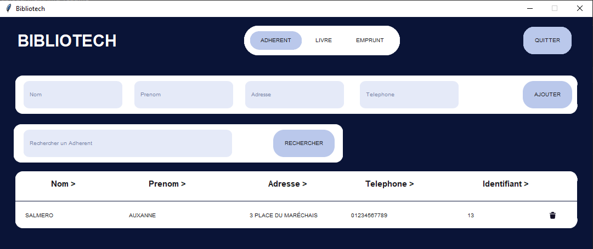
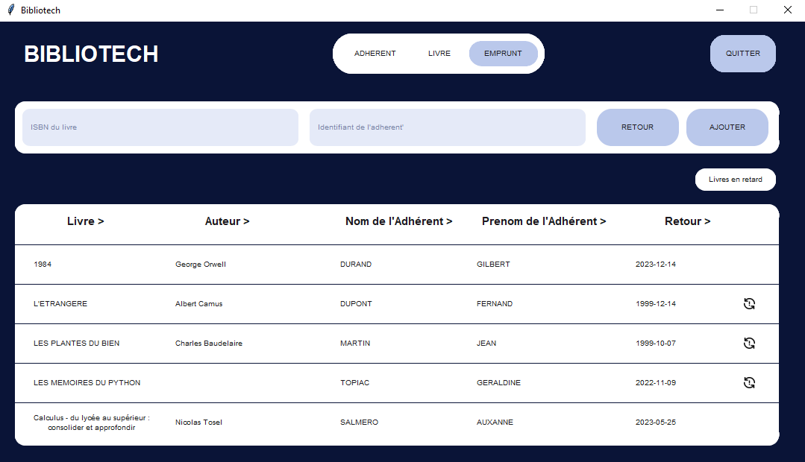

# BIBLIOTECH — Library Management System

A desktop library management application built with Python and CustomTkinter. Manage book inventories with automatic ISBN metadata retrieval, track member registrations, and handle loan/return workflows with overdue detection.

## Features

- Book cataloging with automatic ISBN metadata fetching (title, author, publisher via isbnlib)
- Member (subscriber) registration and management
- Loan issuance with automatic 30-day return date calculation
- Overdue loan detection and visual warnings
- Multi-field search across all views
- Multi-column sorting
- Pagination (10 items per page)
- Dual database engine: PostgreSQL (production) with automatic SQLite fallback
- Data migration tool (SQLite → PostgreSQL)

## Tech Stack

- Python 3.9+
- CustomTkinter 5.1.2+
- Pillow
- isbnlib
- psycopg2-binary
- SQLite3 (standard library)
- pytest

## Project Structure

```text
BIBLIOTECH/
├── assets/
│   └── screenshots/
├── sources/
│   ├── Annexe/
│   ├── BIBLIOTECH.py
│   ├── db.py
│   └── migrate.py
├── tests/
├── .env.example
├── requirements.txt
└── README.md
```

## Getting Started

### Prerequisites

- Python 3.9+
- PostgreSQL (optional)

### Installation

1. Clone the repository:
   ```bash
   git clone https://github.com/tayebg/BIBLIOTECH.git
   cd BIBLIOTECH
   ```
2. Create and activate a virtual environment:
   ```bash
   python -m venv venv
   # On Windows:
   venv\Scripts\activate
   # On macOS/Linux:
   source venv/bin/activate
   ```
3. Install dependencies:
   ```bash
   pip install -r requirements.txt
   ```

### Configuration

1. Copy `.env.example` to `.env`.
2. Configure database settings in `.env` (or leave defaults to use SQLite).

### Run the Application

```bash
python sources/BIBLIOTECH.py
```

### Run Tests

```bash
pytest -v
```

### Database Migration (SQLite to PostgreSQL)

```bash
python sources/migrate.py
```

## Usage

- **Add a Book**: Navigate to the books tab, enter an ISBN, and the system will automatically fetch the metadata. Save it to your catalog.
- **Register a Member**: Open the members tab and fill in the registration details to add a new subscriber.
- **Issue a Loan**: In the loans section, assign a book to a member. The system calculates a 30-day return date automatically.
- **Check Overdue Loans**: Any overdue loans will trigger visual warnings in the dashboard or loan list.

## Screenshots





## Contributing

Contributions are welcome! Please open an issue or submit a pull request.

## License

This project is licensed under the [MIT License](LICENSE).

## Author

[Tayeb Bekkouche](https://github.com/tayebg)
